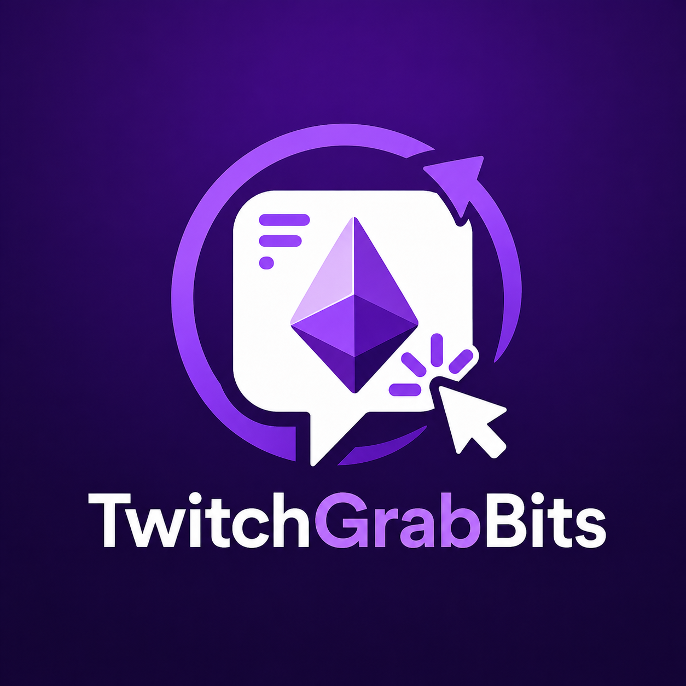

# TwitchGrabBits

A sleek Chrome extension that automatically claims Twitch channel bonus rewards and tracks per-streamer claim counts locally using IndexedDB.

## Screenshot

## Features

- Auto-detects and clicks `button[aria-label="Claim Bonus"]` on `https://www.twitch.tv/*`
- Detects current streamer from `section#live-channel-stream-information` with route-safe normalization
- Supports Twitch SPA navigation without tab reload
- Prevents duplicate clicks using a handled-element set, processing lock, and cooldown
- Stores local claim analytics in IndexedDB via Dexie
- Persists Start/Stop tracking state in `chrome.storage.local`
- Popup Activity tab with search, sorting, totals, delete, clear, and export actions
- Popup About tab with privacy statement and project metadata
- Remote sync architecture scaffolded but disabled by default

## Architecture Summary

- `entrypoints/content.ts`: Twitch page observer, streamer detection, route tracking, safe bonus click flow
- `entrypoints/background.ts`: Typed runtime message handling, IndexedDB writes, broadcast updates, tracking state orchestration
- `entrypoints/popup/*`: React + Material UI popup UI with Activity/About tabs
- `src/db/*`: Dexie schema and transactional repository logic
- `src/twitch/*`: DOM selectors, streamer detection, route observer, bonus detector
- `src/messaging/*`: Message contract types and guards
- `src/sync/*`: Future remote sync provider interfaces and disabled default implementation

## Technology Stack

- Manifest V3
- TypeScript (strict)
- React
- WXT (Vite-powered)
- Material UI
- IndexedDB + Dexie
- Vitest
- ESLint + Prettier

## Local Development

1. Install dependencies:
	 - `pnpm install`
2. Run development mode:
	 - `pnpm dev`

## Build

- `pnpm build`

WXT build output for Chrome is generated under `.output/chrome-mv3`.

## Load Unpacked in Chrome

1. Build the extension using `pnpm build` (or keep `pnpm dev` running).
2. Open `chrome://extensions`.
3. Enable Developer Mode.
4. Click Load unpacked.
5. Select `.output/chrome-mv3`.

## Testing

- Run unit tests: `pnpm test`
- Run linting: `pnpm lint`
- Run type checking: `pnpm typecheck`

## Data Storage

Local IndexedDB database: `TwitchGrabBitsDB`

Tables:

- `streamerStats`
- `claimEvents`
- `extensionSettings`

Tracking toggle persistence:

- `chrome.storage.local` key: `tgb_tracking_enabled`

## Privacy

- Extension only operates on `https://www.twitch.tv/*`
- Claim statistics are stored locally in the browser
- No Twitch password or auth token is collected
- Remote synchronization is disabled by default
- No data is sold or transmitted by the initial version

## Remote Sync Roadmap

A future version may support optional remote synchronization through an API endpoint such as:

- `POST /api/v1/claims/batch`

Current scaffold locations:

- `src/sync/ClaimSyncProvider.ts`
- `src/sync/DisabledClaimSyncProvider.ts`
- `src/sync/RemoteClaimSyncProvider.ts`

To implement real sync later:

1. Implement `RemoteClaimSyncProvider.syncPendingClaims` request/response mapping.
2. Add auth implementation for `AuthProvider`.
3. Wire feature toggle from `extensionSettings.remoteSyncEnabled`.
4. Keep local-first behavior as fallback on API errors.

## Troubleshooting

- Tracking stopped:
	- Ensure the popup toggle is enabled.
- No streamer detected:
	- Twitch may still be rendering stream info; wait a moment or navigate once.
- No claims recorded:
	- Verify the visible button uses `aria-label="Claim Bonus"`.
- Build issues:
	- Reinstall dependencies: `pnpm install`.

## Contributing

1. Create a feature branch from `main`.
2. Run `pnpm lint && pnpm typecheck && pnpm test && pnpm build`.
3. Open a pull request with a clear summary.

## License

MIT. See [LICENSE](LICENSE).

## Disclaimer

TwitchGrabBits is an independent project and is not affiliated with or endorsed by Twitch Interactive, Inc.
